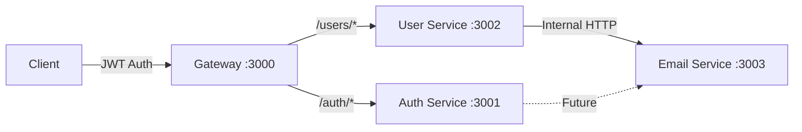
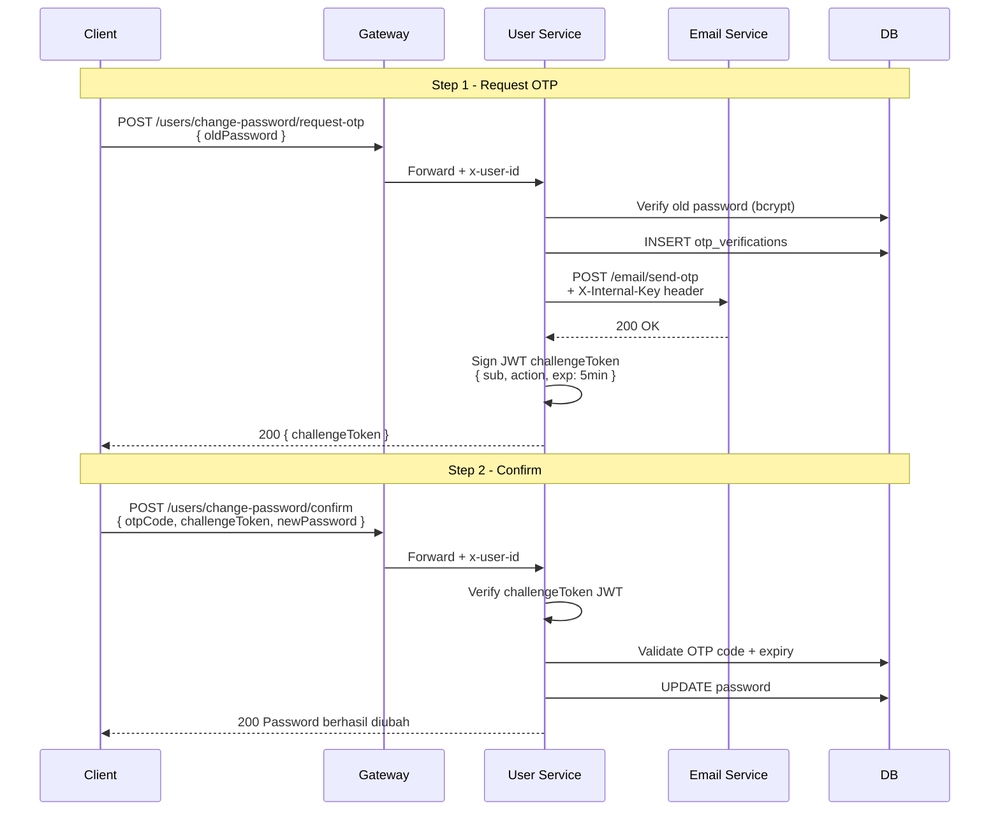

# Refactor: Email Service Terpisah + OTP Challenge Token JWT

## Deskripsi

Dua perubahan arsitektural:
1. **Memisahkan email menjadi `email-services`** — microservice independen di port 3003
2. **Menambahkan OTP Challenge Token (JWT)** — setiap request-otp mengembalikan `challengeToken`, setiap confirm memerlukan token tersebut

## Arsitektur Baru



> [!NOTE]
> **Email Service** tidak diekspos melalui Gateway karena ini adalah **internal service** — hanya dipanggil oleh service lain (user-services, auth-services), bukan oleh client secara langsung.

---

## Internal API Key — Penjelasan & Pro/Kontra

Pendekatan ini dikenal sebagai **Service-to-Service Authentication** atau **Internal API Key Authentication**. Variasinya meliputi:

| Pendekatan | Deskripsi |
|------------|-----------|
| **Static API Key** | Key hardcoded/env variable yang dikirim via header `X-Internal-Key` |
| **Mutual TLS (mTLS)** | Sertifikat SSL dua arah antara service |
| **Service Mesh (Istio/Linkerd)** | Infrastruktur level network yang otomatis enkripsi & autentikasi antar service |
| **OAuth2 Client Credentials** | Setiap service punya client_id/secret, minta token ke auth server |

Untuk skala project kita, yang paling relevan adalah **Static API Key** vs **Tanpa API Key (Network Isolation)**:

### Opsi A: Tanpa API Key (Network Isolation Only)

| Pro | Kontra |
|-----|--------|
| ✅ Simpel, tidak ada overhead | ❌ Siapa pun di jaringan yang sama bisa panggil email-services |
| ✅ Tidak ada key management | ❌ Di development (localhost), semua port terbuka |
| ✅ Cocok jika service di private network/Docker | ❌ Tidak ada audit trail siapa yang memanggil |

### Opsi B: Static Internal API Key

| Pro | Kontra |
|-----|--------|
| ✅ Mencegah akses tidak sah ke email-services | ❌ Sedikit lebih kompleks |
| ✅ Bisa audit: service mana yang memanggil | ❌ Kalau key bocor, harus rotate manual |
| ✅ Mudah diimplementasi (1 middleware + 1 env var) | ❌ Overkill untuk development lokal |
| ✅ Best practice untuk production | |

> [!IMPORTANT]
> **Rekomendasi saya**: Implementasi **Static API Key** karena sangat mudah (hanya 1 middleware + 1 env variable) dan memberikan keamanan ekstra yang signifikan. Implementasinya sesimpel ini:
> ```javascript
> // email-services middleware
> if (req.headers['x-internal-key'] !== process.env.INTERNAL_API_KEY) {
>     return res.status(403).json({ message: "Unauthorized internal request." });
> }
> ```

---

## Alur OTP Baru dengan Challenge Token



---

## Proposed Changes

### 1. Email Services (Microservice Baru)

#### [NEW] `email-services/package.json`
- Dependencies: `express`, `nodemailer`, `dotenv`, `nodemon`

#### [NEW] `email-services/.env`
```env
PORT=3003
SMTP_EMAIL=your_email@gmail.com
SMTP_PASSWORD=your_app_password
INTERNAL_API_KEY=your_random_secret_key
```

#### [NEW] `email-services/src/app.mjs`
- Express server di port 3003
- Middleware validasi `X-Internal-Key`
- Route: `POST /email/send-otp` — menerima `{ to, otpCode, actionType }` → kirim email

#### [NEW] `email-services/src/utils/emailSender.mjs`
- Pindahkan logic Nodemailer + HTML template dari `user-services/src/utils/emailService.mjs`

---

### 2. User Services — Perubahan

#### [DELETE] `user-services/src/utils/emailService.mjs`
- Logic email dipindah ke email-services

#### [MODIFY] [otpController.mjs](file:///e:/PocketLog/PocketLogBE/PocketLogBackend/user-services/src/controllers/otpController.mjs)
Perubahan:
1. Hapus import `emailService` → ganti dengan `fetch()` ke email-services
2. Tambah import `jsonwebtoken`
3. Setiap `request*OTP` → sign JWT challenge token `{ sub: userId, action: actionType }` → return `challengeToken` dalam response
4. Setiap `confirm*` → verify challenge token dari body sebelum validasi OTP

**Response baru dari request-otp:**
```json
{
  "message": "Kode OTP telah dikirim ke email Anda.",
  "challengeToken": "eyJhbGciOiJIUzI1NiIs..."
}
```

**Body baru untuk confirm:**
```json
{
  "otpCode": "123456",
  "challengeToken": "eyJhbGciOiJIUzI1NiIs...",
  "newPassword": "newPass123"
}
```

#### [MODIFY] [.env](file:///e:/PocketLog/PocketLogBE/PocketLogBackend/user-services/.env)
```env
PORT=3002
OTP_CHALLENGE_SECRET=random_secret_for_challenge_tokens
EMAIL_SERVICE_URL=http://localhost:3003
INTERNAL_API_KEY=same_key_as_email_services
```

#### [MODIFY] [package.json](file:///e:/PocketLog/PocketLogBE/PocketLogBackend/user-services/package.json)
- Tambah: `jsonwebtoken`
- Hapus: `nodemailer` (pindah ke email-services)

---

### 3. Root Project

#### [MODIFY] [package.json](file:///e:/PocketLog/PocketLogBE/PocketLogBackend/package.json)
- Tambah `"dev:email": "cd email-services && npm run start:dev"` ke concurrently

---

## Open Questions

> [!IMPORTANT]
> 1. Setuju dengan pendekatan **Static Internal API Key**? Atau ingin skip untuk saat ini (tanpa API key)?
> 2. `INTERNAL_API_KEY` akan saya generate random string. Anda cukup pastikan **nilainya sama** di `.env` email-services dan user-services.

## Verification Plan

### Automated Tests
- Panggil `POST /email/send-otp` langsung ke port 3003 tanpa API key → harus ditolak (403)
- Panggil `POST /email/send-otp` dengan API key yang benar → email terkirim
- Flow lengkap via gateway: request-otp → terima challengeToken → confirm dengan challengeToken + otpCode
- Test challenge token dengan action yang salah (misal: pakai token `change_password` untuk confirm `delete_account`) → harus ditolak
